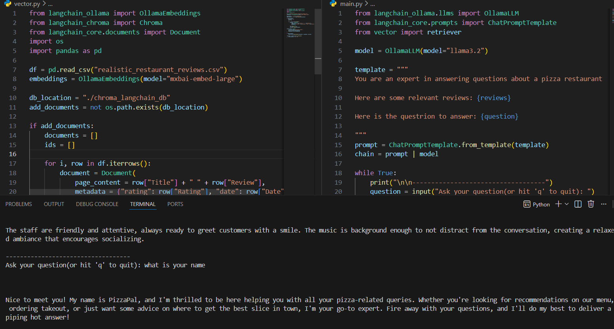

# Local AI Pizza Review Agent (RAG with Ollama & LangChain)




This project is a local AI agent that answers natural‑language questions about a pizza restaurant using its historical reviews. It combines an Ollama LLM with a Chroma vector database (RAG pipeline) so the model can retrieve the most relevant reviews from a CSV file and generate contextual answers – all running locally on your machine.[page:2]

## How it works

1. **Data loading**  
   - `vector.py` reads `realistic_restaurant_reviews.csv` into a pandas DataFrame.[page:2]  
   - For each row, it builds a LangChain `Document` whose `page_content` is the review title + review text, with metadata such as rating and date.[page:2]

2. **Embedding & vector store**  
   - Uses `OllamaEmbeddings` (e.g., `nomic-embed-text` / `nomic-embed-large`) as the local embedding model.[page:2]  
   - Creates a persistent Chroma vector store on disk (e.g., `./chroma_langchain_db`) and, on first run, embeds all reviews and adds them to the collection (e.g., `restaurant_reviews`).[page:2]  

3. **Retriever**  
   - Exposes `retriever = vector_store.as_retriever(search_kwargs={"k": 5})` to fetch the top‑5 most similar reviews for any user query.[page:2]

4. **LLM + prompt chain**  
   - `main.py` creates an `OllamaLLM` instance (e.g., `model="llama3.2"`), which connects to the local Ollama server.[page:2]  
   - Defines a `ChatPromptTemplate`:

     ```
     template = """
     You are an expert in answering questions about a pizza restaurant.
     Here are some relevant reviews:
     {reviews}
     Here is the question to answer:
     {question}
     """
     ```

   - Builds a chain `chain = prompt | model` and invokes it with the retrieved reviews and the user’s question.[page:2]

5. **CLI loop**  
   - Runs an infinite loop, prompting: `Ask your question (q to quit):`.[page:2]  
   - For each question:
     - Calls `retriever.invoke(question)` to get relevant reviews.  
     - Calls `chain.invoke({"reviews": reviews, "question": question})` to generate an answer.  
     - Prints the model’s response to the terminal.[page:2]

All model inference and vector search is performed locally using Ollama, so no external API keys (e.g., OpenAI) are required.[page:2]

## Requirements

- Python 3.10+ (recommended)[page:2]
- Ollama installed and running locally[page:2]
- A GPU is recommended but not strictly required (you can use smaller models on CPU).[page:2]

Python dependencies (see `requirements.txt`):

langchain
langchain-ollama
langchain-chroma
pandas


You also need to pull the required Ollama models, for example:
ollama pull llama3.2
ollama pull nomic-embed-text # or nomic-embed-large, depending on your setup
